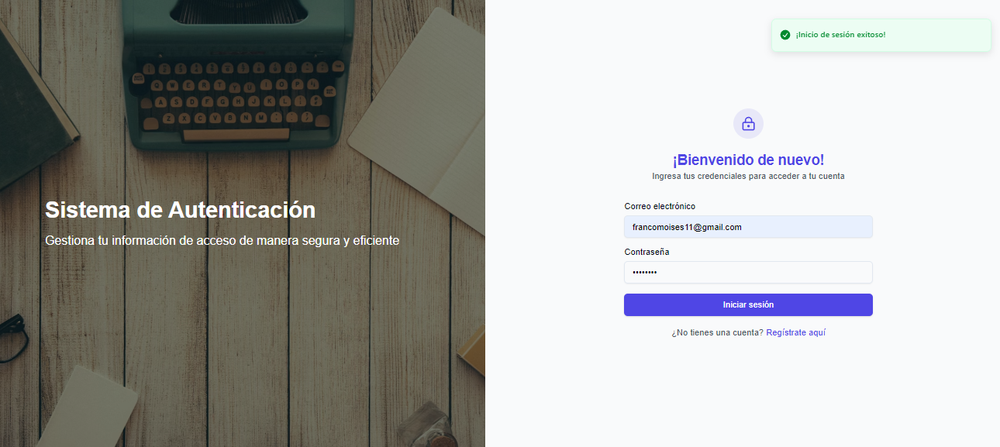

# JWT Authentication with .NET and Next.js

This project demonstrates an example of authentication based on JSON Web Tokens (JWT) using a backend built with .NET and a frontend built with Next.js.

## Technologies Used
- **Frontend**: Next.js
- **Backend**: ASP.NET Core (.NET)
- **Authentication**: JWT

## Project Structure

### Frontend (Next.js):
- Handles user login and displays user information.
- Sends the JWT token in the authorization header for protected API routes.

### Backend (.NET):
- Provides API endpoints for user registration, login, and protected resources.
- Validates user credentials and generates JWT tokens.

## Getting Started

### Clone the Repository:
```bash
  git clone https://github.com/FJMoisesRomero/JWTAuthExample.git
```
### Install Dependencies:
Frontend:
```bash
cd frontend
npm install
```
### Configure Environment Variables:
```bash
backend\UserAuthAPI\appsettings.json
```
### Run the Backend:
```bash
dotnet run --launch-profile "http"
```
### Run the Next.js Development Server:
```bash
cd frontend
npm run dev
```
### Access the Application:
Visit the app at http://localhost:3000

## Additional Notes
### Security:
JWT Secret: Use a strong and unique JWT secret to sign tokens.
Token Storage: Avoid persistently storing tokens on the client side.
Validation: Always validate tokens before accessing protected resources.
### Future Improvements:
- User Roles: Implement user roles and authorization for protected routes.
- Error Handling: Improve error handling and user feedback.
- Database Integration: Connect the backend to a database for user management. The project currently uses PostgreSQL
- Token Refresh: Add a mechanism to refresh tokens before they expire.
  
## Images 📸




